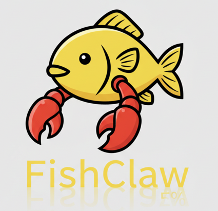

# FishClaw — 闲鱼AI助手
<p align="center">
    
</p>

基于 LLM + Playwright 的闲鱼自动化助手，用自然语言发布商品、管理在售列表。

---

已封装闲鱼MCP [链接](https://github.com/TnoobT/FishClaw_MCP)

---

## 免责声明

> [警告]
> 请勿用于非法用途，否则后果自负。

<details>
<summary>▶ 点击展开完整免责声明</summary>

**1. 使用目的**

本项目仅供学习交流使用，请勿用于任何商业或非法用途。用户理解并同意，任何违反法律法规、侵犯他人合法权益的行为，均与本项目及其开发者无关，后果由用户自行承担。

**2. 使用期限**

您应在下载或保存本项目源代码后 **24 小时内**删除相关文件；超出此期限的任何使用行为，一概与本项目及其开发者无关。

**3. 操作规范**

- 本项目严禁用于窃取他人隐私或进行非法测试、渗透攻击。
- 严禁利用本项目相关技术从事任何非法工作，如因此产生的一切不良后果与本项目及开发者无关。
- 本项目仅允许在授权情况下使用数据，用户如因违反此规定而引发任何法律责任，由用户自行承担。

**4. 免责声明接受**

下载、保存、浏览源代码或安装编译使用本程序，即表示您已阅读并同意本声明，并承诺遵守全部条款。

**5. 免责声明修改**

本声明可能随项目运营情况及法律法规变化进行调整，用户应定期查阅本页面以获取最新版本，并在使用本项目时遵守最新版本的免责声明。

> 请用户慎重阅读并理解本免责声明的所有内容，确保在使用本项目时严格遵守相关规定。

</details>

---

## 功能

### ✅ 发布商品
对话式发布闲鱼商品，全流程自动化：
- 根据技术主题自动生成科技感封面图（调用阿里云 DashScope 图像生成模型）
- 自动生成第一人称口语化商品描述文案（约 500 字，由 LLM 生成）
- 自动填写发布表单（图片上传、描述、分类选择、价格），发布前截图供用户确认
- 用户确认后点击发布（含二次确认机制，防误操作）

### ✅ 管理商品
- 自动跳转个人中心，滚动采集所有在售商品列表（标题、价格、链接）
- 指定商品 URL 后一键 **下架**（草稿状态，可重新上架）或 **删除**（永久删除，含二次确认）

### ✅ 市场调研
- 关键词搜索闲鱼商品，采集标题、价格、链接，用于竞品调研和定价参考

### ✅ 通用工具
- `get_page_content`：读取当前页面可见文字，让 AI 感知浏览器实时状态

### ✅ 登录管理
- 扫码登录（引导用户在弹出浏览器中手动扫码，等待最多 180 秒）
- Cookie 本地持久化，重启后免重复登录
- 所有业务工具内置登录检查拦截器，未登录自动触发扫码流程

### ✅ 养号（可选）
- 模拟真人随机浏览首页、滚动、点进帖子再返回，降低账号风控风险
- 默认关闭，需在初始化时传入 `enable_farming=True`

---

## 技术栈

| 层次 | 技术 |
|------|------|
| **AI 框架** | [Agno](https://github.com/agno-agi/agno) — Agent 编排、工具调用、对话历史 |
| **LLM** | 阿里云 DashScope（`qwen-max` 等，OpenAI 兼容接口） |
| **图像生成** | 阿里云 DashScope `z-image-turbo` |
| **浏览器自动化** | [Playwright](https://playwright.dev/python/) — 有头 Chromium，模拟真实用户操作 |

---

## 项目结构

```
FishClaw/
├── main.py                        # 入口，单 Agent CLI
├── src/
│   ├── models/
│   │   └── config.py              # LLM 配置（从 .env 读取）
│   ├── tools/
│   │   ├── xianyu_tools.py        # Playwright 闲鱼自动化工具集
│   │   ├── generate_image_tools.py # 图像生成工具（DashScope）
│   │   └── prompt_tools.py        # 提示词生成工具（生图词 + 商品文案）
│   ├── tests/
│   │   ├── test_login.py          # 登录工具单测
│   │   ├── test_search_market.py  # 市场搜索单测
│   │   ├── test_draft_item.py     # 草稿填写单测
│   │   ├── test_publish_item.py   # 商品发布单测
│   │   ├── test_get_selling_items.py # 在售列表单测
│   │   ├── test_manage_item.py    # 商品管理单测
│   │   ├── test_get_page_content.py  # 页面内容单测
│   │   └── test_simulate_farming.py  # 养号单测
│   └── cookbook/
│       ├── post_item_agent.py     # 单功能发布 Agent 示例
│       └── manager_item_agent.py  # 单功能管理 Agent 示例
├── assets/
│   ├── logo.png
│   └── default_agent.png          # 无 API Key 时的封面图兜底
├── .cache/
│   ├── cookies/xianyu_cookies.json # Cookie 持久化
│   ├── cache_img/                  # 生成图片缓存
│   └── screenshot/                 # 发布前截图
├── .env                            # 环境变量（不提交）
├── .env.example                    # 环境变量模板
└── pyproject.toml
```

---

## 快速开始

### 1. 安装依赖

```bash
uv venv
venv\Scripts\activate   # Windows
# source .venv/bin/activate  # macOS/Linux
uv sync
playwright install chromium
```

### 2. 配置环境变量

```bash
cp .env.example .env
```

编辑 `.env`，填写以下必填项：

```env
# Agent 推理 + 文案生成用的 LLM
AGENT_LLM_MODEL=qwen-max
AGENT_LLM_API_KEY=your-dashscope-api-key
AGENT_LLM_BASE_URL=https://dashscope.aliyuncs.com/compatible-mode/v1

# 封面图生成（可选，未配置时使用默认图片）
IMAGE_API_KEY=your-dashscope-api-key
```

### 3. 运行

```bash
python main.py
```

### 4. 对话示例

```
You: 帮我发布一个 Python 爬虫技术服务的商品，价格 99 元
# → 自动生成封面图、文案，填写表单，截图确认后发布

You: 查看我现在在售的商品
# → 自动跳转个人中心，滚动采集所有在售商品列表

You: 把第二个商品下架
# → 进入商品详情，点击「下架」并处理确认弹窗

You: 删除第三个商品
# → 进入商品详情，点击「删除」并处理二次确认弹窗

You: 搜索一下 Python 教程，看看竞品价格
# → 在闲鱼搜索，采集前 20 条结果的标题和价格
```

---

## 工具速查

### FishClawTools（闲鱼自动化）

| 工具 | 说明 | 确认 |
|------|------|------|
| `login` | 检查登录状态；未登录则弹出浏览器等待扫码 | — |
| `search_market(keyword)` | 搜索闲鱼商品，采集标题、价格、链接 | — |
| `draft_item(image, description, price)` | 填写商品草稿（图片/描述/分类/价格）并截图 | — |
| `publish_item()` | 点击发布按钮完成商品发布 | ⚠️ |
| `get_selling_items()` | 跳转个人中心，滚动采集所有在售商品 | — |
| `manage_item(item_url, action)` | 对指定商品执行 `delist`（下架）或 `delete`（删除） | ⚠️ |
| `get_page_content()` | 读取当前浏览器页面可见文字（最多 3000 字符） | — |
| `simulate_farming(duration_minutes)` | 模拟真人随机浏览养号（需 `enable_farming=True`） | — |

> ⚠️ 标注的工具设有 `requires_confirmation=True`，执行前会暂停等待用户确认。

### GenerateImageTools（图像生成）

| 工具 | 说明 |
|------|------|
| `generate_image(prompt)` | 调用 DashScope 生成图片，返回本地缓存路径 |

### PromptTools（提示词生成）

| 工具 | 说明 |
|------|------|
| `generate_image_prompt(topic)` | 根据技术主题生成科技感英文生图提示词 |
| `generate_product_description(topic)` | 生成约 500 字第一人称商品描述文案 |

---

## 配置说明

| 环境变量 | 说明 | 默认值 |
|----------|------|--------|
| `AGENT_LLM_MODEL` | Agent 推理模型 | `qwen-max` |
| `AGENT_LLM_API_KEY` | DashScope API Key | — |
| `AGENT_LLM_BASE_URL` | LLM 接口地址 | DashScope 兼容模式 |
| `AGENT_LLM_TEMPERATURE` | 推理温度 | `0.5` |
| `IMAGE_API_KEY` | 图像生成 API Key | — |
| `XIANYU_HOME_URL` | 闲鱼首页地址 | `https://www.goofish.com` |
| `PLAYWRIGHT_HEADLESS` | 是否无头模式 | `false`（有头，降低风控） |
| `BROWSE_COMMENT_TEXT` | 浏览评论内容 | 预设养号文案 |

---

## 测试

每个工具对应一个独立的测试脚本，均位于 `src/tests/` 目录，可直接运行：

```bash
# 登录
python src/tests/test_login.py

# 市场搜索
python src/tests/test_search_market.py

# 草稿填写
python src/tests/test_draft_item.py

# 商品发布（内含草稿填写，用户确认后提交）
python src/tests/test_publish_item.py

# 获取在售商品列表
python src/tests/test_get_selling_items.py

# 商品管理（下架/删除，含交互确认）
python src/tests/test_manage_item.py

# 读取页面内容
python src/tests/test_get_page_content.py

# 模拟养号（默认 1 分钟）
python src/tests/test_simulate_farming.py
```

> 所有测试脚本均使用 `.cache/cookies/xianyu_cookies.json` 作为 Cookie 路径，首次运行会自动触发扫码登录。
